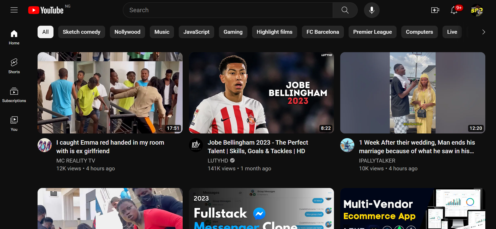

## Product

    TubeClone - YouTube Website Clone

    Welcome to TubeClone, a powerful project that aims to replicate the renowned YouTube platform. 
    This web application provides users with a familiar and robust video-sharing experience, 
    featuring a sleek and customizable interface built with modern web technologies.

    Key Features

    - Video Playback: Seamless video playback with support for various formats.
    - User Authentication: Secure user authentication and account management.
    - Content Discovery: Intuitive navigation for discovering trending and personalized content.
    - Upload and Share: Enable users to upload and share their videos with the community.
    - Comments and Likes: Foster engagement through comments and likes on videos.
    - Responsive Design: A responsive and mobile-friendly layout for a consistent experience across devices.

## Screenshots

    

## Technologies

    NextJs, Typescript, Tailwind, Prettier, EsLint, npm,
 
## Backend Api

## Folder Structure
    # app - Main application folder.
      # (routes) - Application routes/pages.
      # components - Reusable UI components.
      # constants - Constant items.
      # context - Context API for efficient global state management.
      # hooks - Resuable piece of functionality.
      # layouts - Reusable UI layouts.
      # types - Typescript types.
      # globals.css - Global styles.
      # layout.tsx - Next starting point/Root folder.
      # page.tsx - Home route.
    # node_modules - Dependencies.
    # public - Static assets.
    # .eslintrc.json - Eslint configurations.
    # .gitignore - Files and folders to be ignored by git.
    # .prettierrc - Prettier configurations.
    # next.config.js - NextJs configurations.
    # package-lock.json - Npm dependencies and run scripts (No cause for editing).
    # package.json - Npm dependencies and run scripts.
    # README.md - Details about the project.
    # tailwind.config.ts - Tailwind configurations.
    # tsconfig.json - Typescript configurations.
